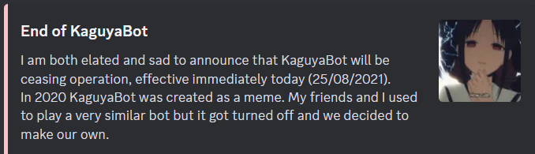

# KCAG

Karuta Card Auto Grab

## Description

For those who might know, there used to be a discord bot similar to [Karuta](https://top.gg/bot/646937666251915264), which came to an end:
\
Since I have made a card farming bot for KaguyaBot, I figured it would be nice to make one for Karuta as well.

## Features

- [x] card farming using anime name
- [ ] card farming using character name
- [ ] card farming using card tier

## Table of Content

- [Installation](#installation)
- [Usage](#usage)
- [Dependency](#dependency)
- [Limitations](#limitations)
- [Disclaimer](#disclaimer)

## Installation

1. Install [Docker](https://www.docker.com/)
2. Git clone this project using ```git clone {url to this project}```.
3. Change working directory to this project folder ```cd path\to\folder```.
4. Add your own [configurations](config/README.md).
5. Run ```build-container.bat```

## Usage

Run ```run-container.bat```

## Dependency

- [pytesseract](https://pypi.org/project/pytesseract/)
- [tesseract-ocr](https://tesseract-ocr.github.io/tessdoc/Installation.html)
- [discord.py-self](https://pypi.org/project/discord.py-self/)
- [opencv-python-headless](https://pypi.org/project/opencv-python-headless/)
- Modified imageio (Added user agent to download discord attachment)

## Limitations

### Inaccurate Words Recognition

The word from the cards drop might not be recognized correctly. This will result in missed grab.

### Script Connection Issue

The script might disconnect from your discord account.\
Possible reasons:

- Your network issue
- Discord rate limitation (unverified)

While there is a fix implemented to automatically reconnect back, it does not always work.

## Disclaimer

I am not responsible for your account getting banned from using this.
It is advisable to try this with your alternate account first.\
**Use at your own risk**
